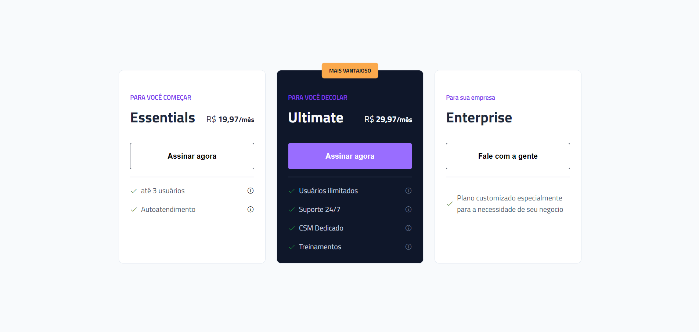
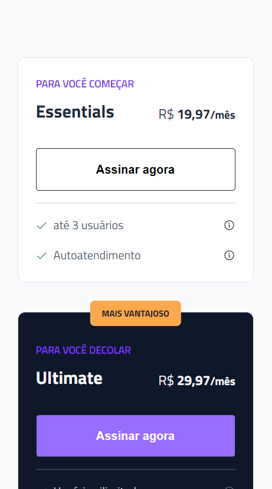
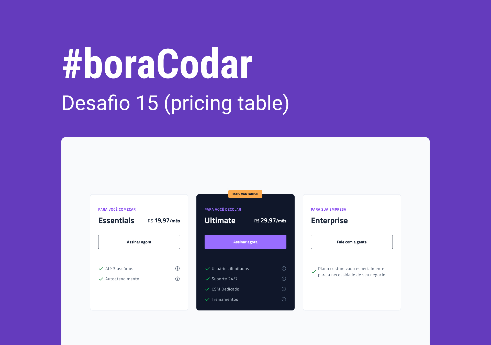

<h1 align="center"> #15 Pricing table </h1>

Criação de uma tabela de preços para o desafio #15 <a href="https://boracodar.dev/">#BORACODAR</a> da RocketSeat 

  <a href="#-tecnologias">Tecnologias</a>&nbsp;&nbsp;&nbsp;|&nbsp;&nbsp;&nbsp;
  <a href="#-projeto">Projeto</a>&nbsp;&nbsp;&nbsp;|&nbsp;&nbsp;&nbsp;
  <a href="#-layout">Layout</a>&nbsp;&nbsp;&nbsp;|&nbsp;&nbsp;&nbsp;

 

## 🚀 Tecnologias

Esse projeto foi desenvolvido com as seguintes tecnologias:

- HTML
- CSS
- JavaScript
- Git e Github
- Figma

## 💻 Projeto

O projeto _Pricing table_ foi realizado como parte do #15 desafio #BORACODAR da RocketSeat.

<h1 align="center">
  Funcionalidades
</h1>

O desafio foi a criação do layout de uma página para expor valores de seu negócio para futuros clientes.

  
  

<!-- 

 -->

## 🔖 Layout

O layout proposto pela RocketSeat através da imagem abaixo</a>. Disponibilizado pelo [Figma](https://figma.com) durante o período do desafio.

  

